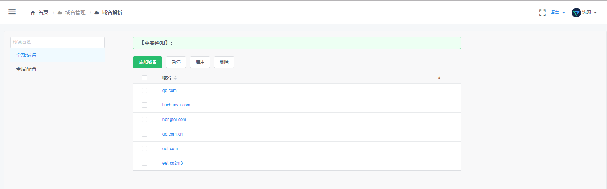
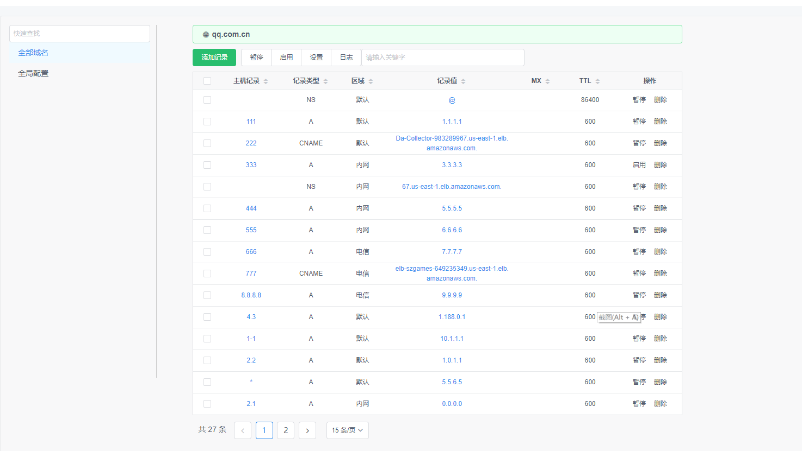
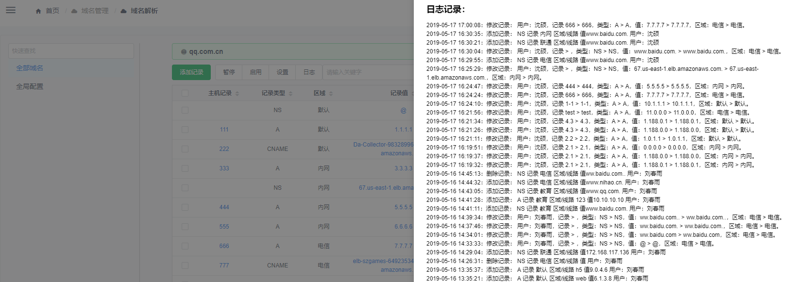
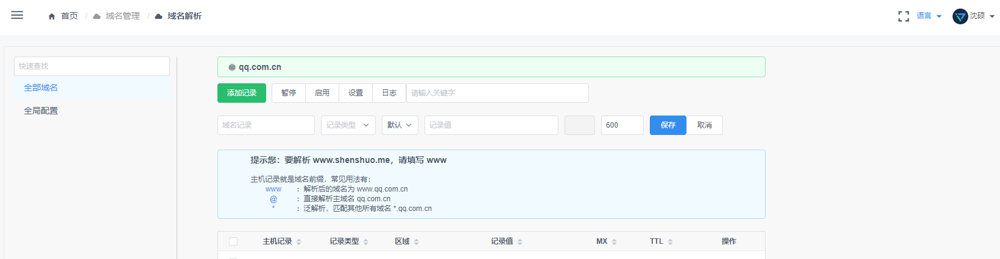
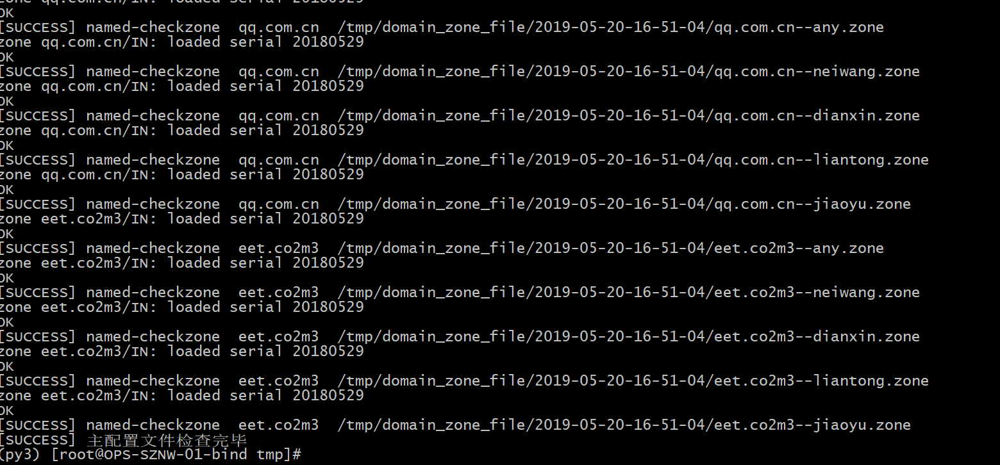

### 域名管理

#### 简介：
> 本服务用来管理DNS，目前仅支持BIND

#### 功能

- 可视化配置bind服务
- 支持多区域智能解析
- 支持多台DNS服务（agent修改配置文件，不强依赖DNS的数据库）
- 简单的规则校验（如果BIND校验区域文件不通过，则当前区域文件不生效）
- 对操作日志进行记录
- 对域名进行监控（暂无）

#### 页面展示
##### 域名列表

##### 区域解析列表

##### 操作日志

##### 添加解析

##### 同步配置文件


#### 项目部署

#### 创建数据库
```sql
create database `codo_dns` default character set utf8mb4 collate utf8mb4_unicode_ci;
```
- 初始化表结构
```bash
python3 /var/www/codo_dns/db_sync.py
```
#### 修改配置
- 对settings 里面的配置文件进行修改 主要为数据库地址 和bind的初始化文件，启动的时候如果数据库不存在bind的初始配置，就会写入数据库
- 修改 doc/nginx_ops.conf 的server_name  例如 改为 dns.opendevops.cn ,当然你也可以直接用IP
- 修改 doc/supervisor_ops.conf 内容来控制进程数量

#### 编译镜像
```bash
docker build . -t codo_dns_image
```
#### docker 启动
> 默认映射出了8060端口
```bash
docker-compose up -d
```
#### 启动后访问地址为 dns.opendevops.cn:8060
#### 测试
```bash
curl -I -X GET -m  10 -o /dev/null -s -w %{http_code}  http://dns.opendevops.cn:8060/are_you_ok/
### 返回200 就代表成功了
```
#### 注册网关 用户登录 URI鉴权是通过网关来处理的（必须，莫忘）。

> 参考[api网关](https://github.com/ss1917/api-gateway/blob/master/README.md)

#### BIND部署（centos7）
[BIND 搭建](./doc/bind.md)

#### 多区域支持
- 把doc下的所有的named 开头的文件放入 bind服务器的 /var/named/chroot/etc/ 目录下
- 这里是和 settings 下的默认bind配置文件进行关联

#### 自定义区域
> 略。。。 请自行研究文档

#### 获取最新配置 （在BIND服务器上）
- 建议放入系统crontab 中，  日志请自行重定向， 并且建议报错发送报错日志 

- 修改配置相关参数

- - api_url 就是你系统API地址 比如` https://demo.opendevops.cn/api/`

- - auth_key 为登录令牌，获取和使用方法详见 admin模块，创建一个用户，赋值权限，并获取其toekn

  - 下面三个URI的GET权限`/dns/v2/dns/bind/domain/` `/dns/v2/dns/bind/zone/` `/dns/v1/dns/bind/conf/`  

- - 下面为 获取配置的脚本 ，在项目的 libs目录下。

- - ```domain_sync.py ```  使用python3 执行 `python3 domain_sync.py `
- 你也可以自己根据接口开发

#### 域名监控 
> 暂无

## License

Everything is [GPL v3.0](https://www.gnu.org/licenses/gpl-3.0.html).
